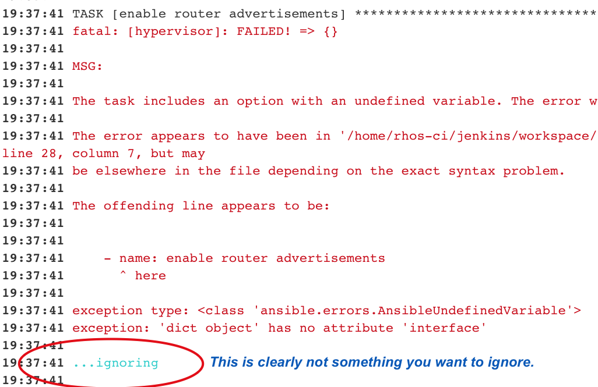

# Ansible ignore\_errors are evil

If you ever used `ignore_errors`before you probably observed one of its side effects:

* Ansible console output becomes much harder to inspect because your it will contain lots of red \(failed\) task around, so scrolling to the right line would be much harder.
* It will trigger Ansible debugger if you configured `ANSIBLE_STRATEGY=debug`, even if you are likely not to want this making the use of debugger kinda useless if you have lots of such ignore\_errors. 
* Even code/logic/module errors are ignored, where it would not make any sense to continue.



For example if you are searching for files or processes it is likely that your command will return a error code when nothing is found. Still, nothing found can often mean something expected. 

Most people go to the evil old `ignore_errors` in order to make ansible pass that task returning an error code different than zero... just because that is what they mind tells them "that's not an error"… when if is not an error lets make it a success. 

Nope, doing `command || true` is not the right way to make it a success, this would make impossible for you to check error code later \(`result.rc`\). 

In cases like this is better to use `failed_when: false`, or whatever condition you want to put there instead of `false`. This tells ansible to treat the task as a success \(green\) and not a failure that would be ignored. 

From the execution point of view the results may be similar, only difference being that the `result.failed` would be `true` or `false`. `result.rc` and all the other properties still remain the same. Keep in mind that the task failure status is supposed to tell you if task failed, not if files were found or not. 

There is a **huge difference** on how the output looks:


Here is the code used to exemplify the difference:



```yaml
#!/usr/bin/env ansible-playbook -v
- hosts: 'localhost'
  tasks:
 
  - name: getting list of foobar processes with ignore errors
      shell: pgrep foobar
      ignore_errors: yes
 
  - name: getting list of foobar processes with changed_when
      shell: pgrep foobar
      failed_when: false
      changed_when: false
```



As you probably observed I also included `changed_when: false`, as this task does not modify anything on the target machine, it only reads data. This is important too because ansible will report task as changed if you do not, something that is also confusing. Ideally if you run a playbook twice, you should get `changed=0`at the end, but somehow I have the impression that you are not there yet ;\)

